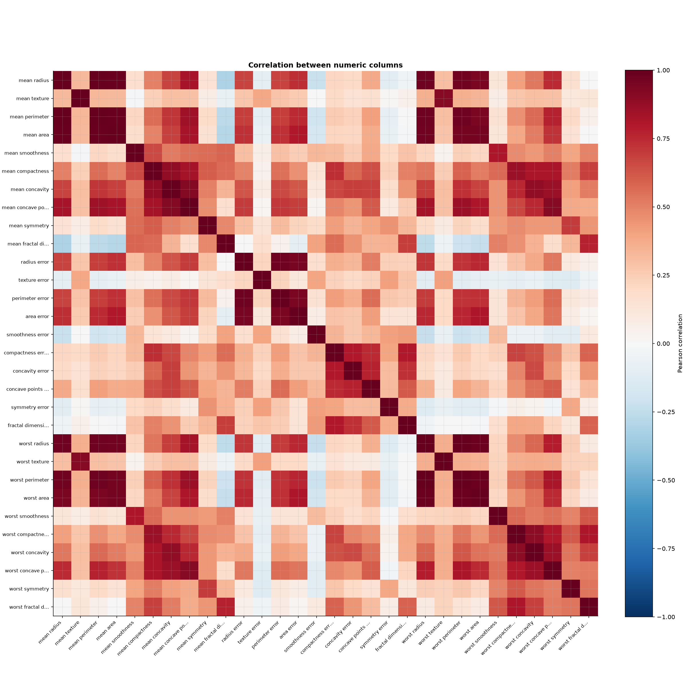
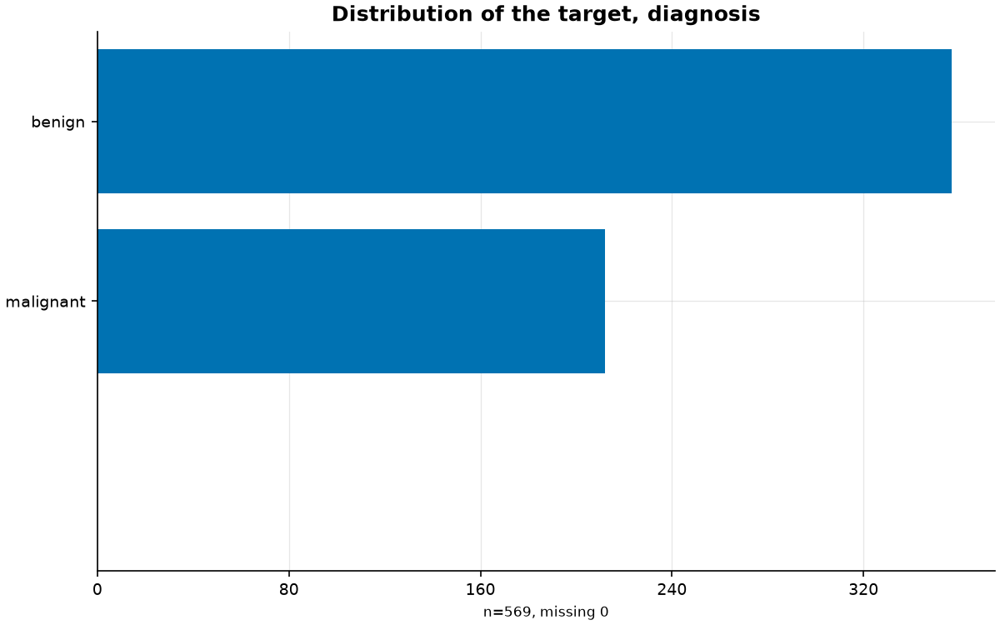

# DataDoctor

[](https://github.com/mahdidaraeii/datadoctor/actions/workflows/ci.yml)

A diagnostic workbench for tabular datasets. Give it a CSV and a target column and it reports
what is wrong with the data, whether the data is safe to model, and draws its distributions and
relationships. It is not an AutoML tool and not a dashboard: it never fills a value, drops a row
or fits a model on its own — every finding says what was computed, what it might mean, and what
is uncertain, and leaves the decision to you.

## Install

```
uv pip install -e .
```

Extras, when needed: `.[parquet]` and `.[excel]` add support for those file formats; `.[dev]`
adds both plus the test and lint tooling.

## Run

```
uv run -m datadoctor <command> <path> [options]
```

Three commands: `profile`, `quality` and `explore`. Every one accepts `--target <column>` (the
column to be predicted, if there is one), `--format`, `--separator`, `--encoding`, `--sheet` and
`--text-column` to control how the file is read, and `--help` for the full list.

The examples below run against `data/sample/breast_cancer.csv`, one of two small, real, clearly
licensed datasets bundled for exactly this purpose — see [`data/sample/README.md`](data/sample/README.md)
for both, including [`wine_quality.csv`](data/sample/wine_quality.csv), the regression one.
`data/telecom_customers.csv` is a third, unrelated example: a synthetic dataset kept intentionally
messier, used throughout development to surface real defect-detection gaps rather than to
demonstrate clean output.

### `profile`

Schema and provenance: what type each column was read as, how the file was hashed, and what the
loader had to do to read it (tokens read as missing, leading zeros lost, and so on).

```
uv run -m datadoctor profile data/sample/breast_cancer.csv --target diagnosis
```

```
Provenance
+-----------------------------------------------------------------------------+
| File                  | data/sample/breast_cancer.csv                       |
| Shape                 | 569 rows, 31 columns                                |
| Versions              | datadoctor 0.1.0, python 3.12.12, pandas 3.0.6      |
| Config                | seed 42, row threshold 100000, column threshold 100 |
| Read as missing       | none                                                |
| Leading zeros dropped | none                                                |
+-----------------------------------------------------------------------------+

Schema (569 rows, 31 columns)
+---------------------------------------------------------------------------------+
| Column                  | Dtype   | Type        | Distinct | Nulls | Identifier |
|-------------------------+---------+-------------+----------+-------+------------|
| mean radius             | float64 | numeric     |      456 |     0 | -          |
| ...                                                                             |
| diagnosis               | str     | categorical |        2 |     0 | -          |
+---------------------------------------------------------------------------------+
```

`--json <path>` writes the same result as JSON instead.

### `quality`

Findings, most severe first: missingness, duplicates, constants, outliers, dtype problems,
impossible values and possible personal data.

```
uv run -m datadoctor quality data/sample/breast_cancer.csv --target diagnosis
```

```
Quality: breast_cancer (569 rows, 31 columns)
Findings: 2 (1 medium, 1 low)

 MEDIUM  Extreme values in numeric columns  confidence 0.7
  Columns:        mean radius, mean texture, mean area, ... and 18 more.
  Evidence:       23 columns have values more than 3 interquartile ranges beyond the quartiles
                  and more than 3 standard deviations from the mean: fractal dimension error
                  (10 values; quartiles 0.002248 and 0.004558, wide fences -0.004682 to
                  0.011488); ...
  Interpretation: Values this far from the rest are candidates for data errors, such as a wrong
                  unit, a typo or a faulty sensor, or for real but rare events. They are
                  candidates, not errors: one column alone cannot tell which.
  Recommendation: Look at the rows behind these values and decide whether each is an error or a
                  real extreme.
```

Real measurements have real outliers, so this finding is expected on a clean, real dataset — it
is graded MEDIUM and confidence 0.7, a candidate to look at, not a defect asserted outright. Try
`data/telecom_customers.csv` instead to see planted-looking data-entry problems (a stray token
among numbers, dates in the future, a constant column) surface the same way.

### `explore`

Saves a correlation heatmap, each feature's relationship to the target, and every column's own
distribution, as PNG files, and prints the list.

```
uv run -m datadoctor explore data/sample/breast_cancer.csv --target diagnosis
```

```
Explore: breast_cancer (569 rows, 31 columns)
Files: 6
  correlation_heatmap: outputs\correlation_heatmap.png
  target_distribution: outputs\target_distribution.png
  univariate_categorical_1: outputs\univariate_categorical_1.png
  univariate_numeric_1: outputs\univariate_numeric_1.png
  univariate_numeric_2: outputs\univariate_numeric_2.png
  univariate_numeric_3: outputs\univariate_numeric_3.png

Findings: 2 (1 low, 1 info)

 LOW  Numeric columns are strongly correlated  confidence 1.0
  Columns:        area error, compactness error, concavity error, ...
  Evidence:       44 pairs of columns have an absolute Pearson correlation of at least 0.8: ...
```

Two of the six files generated by the command above are committed under
[`outputs/example/`](outputs/example/) as a worked example:

**`correlation_heatmap.png`** — Pearson correlation between all 30 numeric features. The dense
red blocks are the tumor-size measurements (radius, perimeter, area and their "worst" variants),
which move together almost perfectly, matching the LOW finding above.



**`target_distribution.png`** — the class balance of `diagnosis`: 357 benign, 212 malignant.
Close enough to even that no imbalance finding fires.



The other four files (the per-column histograms and bar charts) are in the same directory.

## Development

See [`CLAUDE.md`](CLAUDE.md) and [`BUILD_STEPS.md`](BUILD_STEPS.md) for how this project is
built and the rules that apply to every step.
